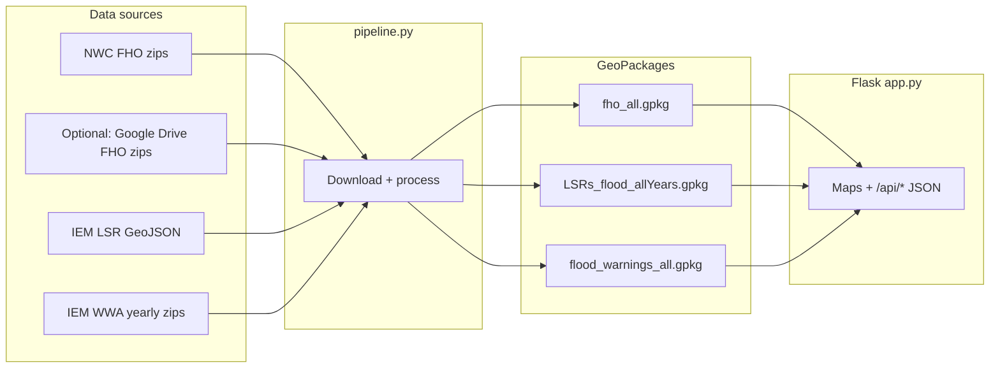

# FHO Evaluation

A **Flood Hazard Outlook (FHO) verification** toolkit: it builds three GeoPackages from public NWS/IEM sources (or optional Google Drive FHO zips), then serves a **Flask** dashboard to compare FHO polygons against flood-related **Local Storm Reports (LSRs)** and **flood warnings (WWA)**.

There are two main experiences in the browser:

| Route | Purpose |
|-------|---------|
| `/` | FHO evaluation — pick date, AM/PM, forecast period, impact level; map + verification stats (POD-style checks, charts). |
| `/ibw-validation` | IBW validation — focus on high-impact flash-flood warnings and geometry coverage. |

---

## How it fits together



- **`pipeline.py`** — preferred way to produce or refresh the three `.gpkg` files in the project root.
- **`app.py`** — loads those files (EPSG:4326 for the map), caches responses, exposes REST endpoints used by `static/js/app.js` and `static/js/ibw.js`.

---

## Requirements

- **Python** 3.9+ (Dockerfile targets 3.9; newer 3.x generally works with pinned deps in `requirements.txt`).
- **Disk** — `fho_all.gpkg` is large (on the order of ~1+ GB depending on years and layers); allow several GB free.
- **RAM** — 8 GB+ recommended when loading full FHO + LSR + warnings in the app.

### Python dependencies

Install from the repo root:

```bash
pip install -r requirements.txt
```

Stack highlights: **Flask**, **GeoPandas**, **Pandas**, **Shapely**, **Fiona**, **PyProj**, **requests**, **tqdm**. Production serving often uses **Gunicorn** (`gunicorn.conf.py`).

---

## Data outputs (required by the app)

Place these next to `app.py` (or mount them there in Docker):

| File | Contents |
|------|----------|
| `fho_all.gpkg` | Layers `fho_{year}_{am\|pm}` (e.g. `fho_2024_am`). Includes synthetic **`Limited_merged`** polygons from the pipeline. CRS in file: **EPSG:5070** (app reprojects for the map). |
| `LSRs_flood_allYears.gpkg` | Point LSRs; flood / flash flood only. Expected columns include `VALID`, `LAT`, `LON`, `EVENT`, `REMARKS`, `geometry`, etc. |
| `flood_warnings_all.gpkg` | Layers `wwa_{year}`. Flood polygons (`PHENOM` FF/FL), with **`DAMAGTAG`** for IBW damage tags when present. |

The app watches file modification times and **reloads** when GeoPackages change (with backoff if a reload fails).

---

## Building data: `pipeline.py` (recommended)

Unified download + processing (NWC / IEM by default). SSL verification is disabled for some government hosts that use certificates the stack may not trust; this matches operational needs for this project.

### Common commands

```bash
# Default years: 2022 through current calendar year; all three datasets
python pipeline.py

# Only certain years
python pipeline.py --years 2024 2025

# One dataset only
python pipeline.py --only fho
python pipeline.py --only lsr
python pipeline.py --only wwa

# Force full rebuild (ignore incremental state)
python pipeline.py --full

# More parallel download workers
python pipeline.py --workers 8
```

### Incremental runs

If `pipeline_state.json` already exists and contains progress, a normal run **auto-switches to update mode** (only new FHO dates / LSR range / incomplete WWA years). Use **`--full`** to ignore that state and rebuild from scratch.

Legacy **`--update`** is still accepted for compatibility; behavior is the same as the auto-detected incremental mode.

### FHO source options (`--fho-source`)

- **`nwc`** (default) — zips from National Weather Center operations, e.g.  
  `https://ops.nwc.nws.noaa.gov/products/{YEAR}/final/FHO/shpzip/...`  
  Missing dates (weekends/holidays) are normal; the pipeline skips 404s.
- **`gdrive`** — uses **gdown** with browser cookies for a shared Drive folder of FHO zips (see `--browser`: `edge`, `chrome`, or `firefox`).
- **Path** — local directory of FHO zip files.

### State file

`pipeline_state.json` tracks things like last FHO issuance date per year/mode, last LSR end date, and WWA year completion. Safe to delete if you want a clean incremental baseline (or use `--full`).

### Data sources (reference)

| Dataset | Source |
|---------|--------|
| FHO shapefiles | NWC `ops.nwc.nws.noaa.gov` or optional Google Drive |
| LSR | IEM `mesonet.agron.iastate.edu/geojson/lsr.php` (fetched in ~90-day chunks) |
| WWA | IEM `mesonet.agron.iastate.edu/pickup/wwa/{YEAR}_all.zip` |

---

## Alternative: pre-built zip from Google Drive

`download_fhoData.py` downloads a **single zip** from Google Drive (see the script for the file ID), extracts `.gpkg` files into the current directory, and removes the zip. Use this if you do not want to run the full pipeline locally.

---

## Running the web app

From the repository root (with the three GeoPackages present):

```bash
python app.py
```

Open **http://127.0.0.1:5000/** (or the host/port Flask prints).

### API surface (for dashboards / automation)

All JSON POST bodies are specific to the UI; typical endpoints:

- `GET /api/available-dates` — dates and metadata for controls.
- `POST /api/stats` — verification stats for the main FHO view.
- `GET /api/high-impact-events` — quick-pick list for high-impact warnings.
- `POST /api/ibw-stats` — IBW validation page stats.
- `POST /api/export-csv` — export path for tabular results.

### Production-style run

```bash
gunicorn --config gunicorn.conf.py app:app
```

---

## Docker

Build and run from the repo root (compose file lives under `docker/`):

```bash
docker compose -f docker/docker-compose.yml build
docker compose -f docker/docker-compose.yml up
```

The compose file **bind-mounts** the three GeoPackages from the parent directory as **read-only**, plus `templates/`, `static/`, and `gunicorn.conf.py`. Update the `.gpkg` files on the host, then restart or wait for the app’s reload logic to pick up new mtimes.

**Note:** `docker-compose` (v1) also works if you still use the hyphenated command.

---

## Project layout

| Path | Role |
|------|------|
| `app.py` | Flask app, data load, caching, geometry/stats logic |
| `pipeline.py` | Download + ETL to the three GeoPackages |
| `pipeline_state.json` | Incremental pipeline progress (generated) |
| `templates/fho_evaluation.html` | Main FHO page |
| `templates/ibw_validation.html` | IBW page |
| `static/js/app.js` | Main UI logic |
| `static/js/ibw.js` | IBW page logic |
| `static/css/styles.css` | Shared styling |
| `gunicorn.conf.py` | Gunicorn settings |
| `docker/` | Dockerfile + compose |

### Reference-only scripts

These are **not** the unified pipeline; they document or reproduce earlier one-off workflows. Prefer **`pipeline.py`** for end-to-end builds:

- `FHO_process_summary.py`, `LSRs_csv_to_gpkg.py`, `SBWs_shps_to_gpkg_final.py` — original local-file processing patterns.
- `greg/` — experimental downloads / alternate apps (historical).

---

## Troubleshooting

1. **`Data not loaded` / missing layers**  
   Ensure all three `.gpkg` files exist beside `app.py` and layer names match expectations (`fho_{year}_{am|pm}`, `wwa_{year}`, LSR default layer). Run `python pipeline.py` or extract data with `download_fhoData.py`.

2. **Slow first load**  
   Reading large GeoPackages and building spatial indexes takes time. Subsequent requests benefit from in-memory caches.

3. **Port 5000 in use**  
   Stop the other process or change the port in Flask / compose port mapping.

4. **Pipeline SSL or 404 noise**  
   NWC 404s for missing issuance days are expected. Persistent SSL errors on corporate networks may require proxy settings outside the scope of this README.

5. **Google Drive FHO (`--fho-source gdrive`)**  
   You must be able to authenticate via browser cookies; use `--browser` matching the browser where you’re logged into Google.

---

## Contributing

Fork, branch, and open a pull request with a clear description of behavior changes (especially any change to GeoPackage schemas or API JSON shapes, which affect the bundled frontend).

---

## License

License information is provided in the repository’s license file when present; otherwise follow the terms set by the project maintainers.
