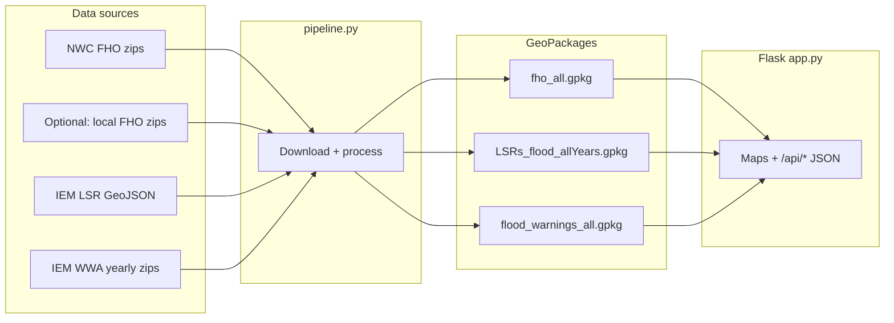

# FHO Evaluation

The **Flood Hazard Outlook (FHO) verification** toolkit that builds three GeoPackages from public NWS/IEM sources (or local FHO zip files), then serves a Flask dashboard to compare FHO polygons against flood-related **Local Storm Reports (LSRs)** and **flood warnings (WWA)**.



---

## Quick start

### 1. Install dependencies

Use **Python 3.13** for installs. Geo stack wheels (Fiona, etc.) track CPython releases; **3.14+** often has no pre-built wheels yet, so `pip` may try to compile GDAL and fail unless you have a full GDAL dev setup.

```bash
pip install -r requirements.txt
```

**Windows with multiple Pythons:** if `python` points at 3.14, run `py -3.13 -m pip install -r requirements.txt` and `py -3.13 app.py` / `py -3.13 pipeline.py` instead.

### 2. Build the data

```bash
python pipeline.py
```

This downloads and processes all three datasets (FHO, LSR, WWA) for 2022 through the current year, producing three `.gpkg` files in the project root. See [Pipeline details](#pipeline-details) for filtering, incremental runs, and local source options.

### 3. Run the app

```bash
python app.py
```

Open **http://127.0.0.1:5000/**. The app reads the GeoPackages, reprojects from EPSG:5070 to EPSG:4326 for Leaflet, and pre-builds spatial indexes at load time. It watches file modification times and **auto-reloads** when GeoPackages change.

---

## The dashboard

### FHO Evaluation (`/`)

Pick a date, AM/PM issuance, and forecast period to see FHO polygons verified against LSRs and FFWs. Stats include polygon verification rates, event capture rates, area-bin breakdowns, and daily time series — all rendered with Chart.js.

- **Custom Leaflet panes** enforce strict z-ordering: Catastrophic FFWs always render on top of Considerable, which renders on top of No-Tag FFWs.
- **View preservation** — switching forecast period (1-3 / 4-7 / 1-7) or AM/PM keeps the current map view. Only date changes re-fit the bounds.
- **Keyboard shortcuts** — `←`/`→` step dates, `1`/`2`/`3` set forecast period, `A`/`P` toggle AM/PM.
- **Quick Select** pre-loads high-impact events (Considerable/Catastrophic FHO days and FFW-only days).
- **CSV export** for the current filter selection.

### IBW Validation (`/ibw-validation`)

Focuses on high-impact flash-flood warnings and how they align with Considerable/Catastrophic FHO polygons. Quick Select with `‹`/`›` event stepping arrows to move through events.

### Shared map features

Both pages include:

- **Stacked popups** — clicking where features overlap opens a pager popup (`‹ 1/N ›` arrows) to cycle through them, ordered by visual layer priority (LSR points first, then FFWs by severity, then FHO polygons).
- **Feature highlighting** — the currently inspected feature gets a yellow outline/ring that clears when the popup closes.
- **Ray-cast hit-testing** — accurate point-in-polygon containment for Polygon and MultiPolygon geometries (no turf.js dependency).
- **Colorblind-safe palette** throughout.

---

## Pipeline details

### Common commands

```bash
# Full run: all years (2022–current), all datasets
python pipeline.py

# Specific years
python pipeline.py --years 2024 2025

# Single dataset
python pipeline.py --only fho
python pipeline.py --only lsr
python pipeline.py --only wwa

# Force full rebuild (ignore saved state)
python pipeline.py --full

# More parallel download workers
python pipeline.py --workers 8

# FHO from a local zip folder (searches recursively)
python pipeline.py --fho-source "C:/data/fho_zips"
```

When all three datasets run together (no `--only`), they execute **concurrently** in separate threads.

### Incremental runs

If `pipeline_state.json` exists, the pipeline auto-detects prior progress and only fetches new data (new FHO dates, extended LSR range, incomplete WWA years). Use `--full` to ignore saved state and rebuild from scratch. The legacy `--update` flag is still accepted for compatibility.

### FHO source (`--fho-source`)

- **`nwc`** (default) — downloads from NWC operations at `ops.nwc.nws.noaa.gov`.
- **Local path** — a directory of FHO zips (e.g. `fho_YYYYMMDD_am_final.zip`). Supports nested layouts and early-2022 `fho_national_*` naming. Use this when you maintain a local mirror.

### State file

`pipeline_state.json` tracks incremental progress (last FHO date per year/mode, last LSR end date, WWA year completion). Created and updated automatically. Safe to delete for a clean baseline.

### Data sources

| Dataset | Source |
|---------|--------|
| FHO | NWC `ops.nwc.nws.noaa.gov` or local zip directory |
| LSR | IEM `mesonet.agron.iastate.edu/geojson/lsr.php` (chunked into ~90-day windows) |
| WWA | IEM `mesonet.agron.iastate.edu/pickup/wwa/{YEAR}_all.zip` |

---

## GeoPackage schemas

The three `.gpkg` files must be in the same directory as `app.py`. The app auto-discovers all years present — no code change needed when a new year is added.

| File | Layers | Key columns | Notes |
|------|--------|-------------|-------|
| `fho_all.gpkg` | `fho_{year}_{am\|pm}` | `polygon_id`, `issuance_date`, `issuance_time`, `forecast_period`, `impact_level`, `valid_start`, `valid_end`, `area_sqkm`, `area_bin`, `source_category` | Includes synthetic `Limited_merged` rows. `"no area"` placeholders excluded. |
| `LSRs_flood_allYears.gpkg` | `LSRs_flood_allYears` | `VALID`, `LAT`, `LON`, `EVENT`, `REMARKS`, `CITY`, `STATE`, `SOURCE`, `WFO`, `TYPECODE` | Flood and flash flood only. |
| `flood_warnings_all.gpkg` | `wwa_{year}` | `PHENOM`, `ISSUED`, `EXPIRED`, `DAMAGTAG`, `year` | FF/FL polygon-only. `DAMAGTAG` filled with `""` if missing from source. |

All files use **EPSG:5070** (the app reprojects to EPSG:4326 for the map).

---

## API endpoints

| Method | Path | Purpose |
|--------|------|---------|
| GET | `/api/available-dates` | Dates with FHO data for populating controls |
| POST | `/api/stats` | Verification stats + map geometries for the FHO page |
| GET | `/api/high-impact-events` | Quick Select list of high-impact events |
| POST | `/api/ibw-stats` | IBW validation page stats + geometries |
| POST | `/api/export-csv` | CSV export of daily verification data |

Responses are cached server-side (LRU, max 32 entries per endpoint) and client-side in the browser.

---

## Project layout

| Path | Role |
|------|------|
| `app.py` | Flask app — data loading, caching, geometry/stats logic |
| `pipeline.py` | Download + ETL producing the three GeoPackages |
| `pipeline_state.json` | Incremental progress (generated, safe to delete) |
| `requirements.txt` | Python dependencies |
| `templates/fho_evaluation.html` | FHO Evaluation page template |
| `templates/ibw_validation.html` | IBW Validation page template |
| `static/js/app.js` | FHO page JS |
| `static/js/ibw.js` | IBW page JS |
| `static/js/shared.js` | Shared helpers (error display, segmented controls, date formatting) |
| `static/css/styles.css` | Shared CSS (custom properties, popup-pager, responsive layout) |

**Tech stack:** Flask 3, GeoPandas 1+, Pandas 2.2+, NumPy, Shapely 2, Fiona, PyProj, requests, tqdm. Frontend (CDN): Leaflet 1.9.4, Bootstrap 5.3.8, Chart.js 4.5.1, html2canvas 1.4.1, Turf.js 7.3.4 (IBW page).

---

## Troubleshooting

1. **`Data not loaded` / missing layers** — Ensure all three `.gpkg` files exist beside `app.py` with the expected layer names (`fho_{year}_{am|pm}`, `LSRs_flood_allYears`, `wwa_{year}`). Run `python pipeline.py`.
2. **Wrong Python / missing packages** — Use the same interpreter for `pip` and `run`. If install fails on **Fiona** with “GDAL API version” / `gdal-config`, switch to **Python 3.13** (or install OS-level GDAL build tools — harder on Windows).
3. **Slow first load** — Reading large GeoPackages and building spatial indexes takes time. Subsequent requests benefit from in-memory caches.
4. **Port 5000 in use** — Stop the other process or change the port in Flask config.
5. **Pipeline SSL or 404 noise** — NWC 404s for missing issuance days are expected. Persistent SSL errors on corporate networks may require proxy configuration.
6. **Low polygon counts / `<< NO DATA` months** — (a) The local archive may be incomplete — the monthly summary prints the actual date range on disk. (b) Issuance days with `CATEGORY = "no area"` are intentionally excluded. The `source_category` column retains the raw string for debugging.
7. **IBW Quick Select shows unexpected events** — The high-impact FFW list compares FFW dates against FHO dates. After a fresh pipeline run, restart the Flask app to reload GeoPackages.

---

## Contributing

Fork, branch, and open a pull request with a clear description of behavior changes — especially any change to GeoPackage schemas or API response shapes, which affect the frontend.

---

## License

License information is provided in the repository's license file when present; otherwise follow the terms set by the project maintainers.
