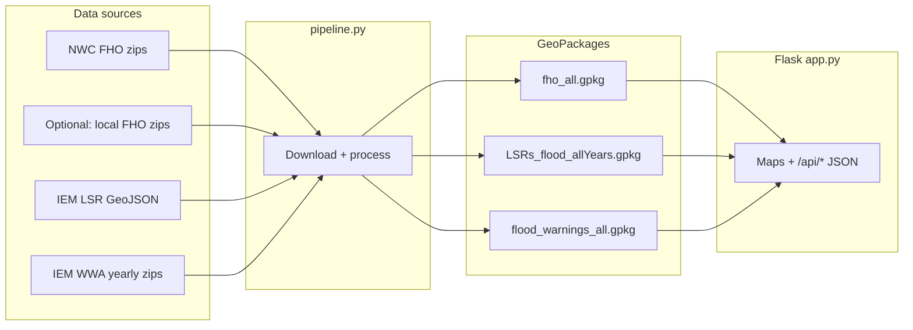

# FHO Evaluation

A **Flood Hazard Outlook (FHO) verification** toolkit: it builds three GeoPackages from public NWS/IEM sources (or from **local** FHO zip files), then serves a **Flask** dashboard to compare FHO polygons against flood-related **Local Storm Reports (LSRs)** and **flood warnings (WWA)**.

There are two main experiences in the browser:

| Route | Purpose |
|-------|---------|
| `/` | FHO evaluation — pick date, AM/PM, forecast period, impact level; map + verification stats (POD-style checks, Chart.js charts). |
| `/ibw-validation` | IBW validation — focus on high-impact flash-flood warnings and geometry coverage. |

---

## How it fits together



- **`pipeline.py`** — preferred way to produce or refresh the three `.gpkg` files in the project root (same directory as `app.py` when you run the app locally).
- **`app.py`** — reads GeoPackages stored in **EPSG:5070**, **reprojects to EPSG:4326** for Leaflet, caches API responses, and exposes REST endpoints consumed by `static/js/app.js` and `static/js/ibw.js`.

---

## Requirements

- **Python** 3.9+ (Docker image uses 3.9; 3.9–3.12 are the safest choices while **Fiona** wheels exist for your platform).
- **Disk** — `fho_all.gpkg` is large (on the order of ~1+ GB depending on years and layers); allow several GB free.
- **RAM** — 8 GB+ recommended when loading full FHO + LSR + warnings in the app.

### Python dependencies

Install from the repo root with the **same interpreter** you will use to run scripts:

```bash
python -m pip install -r requirements.txt
```

**Windows:** If your default `python` is very new (e.g. 3.14) and **Fiona** fails to install (GDAL build errors), use a Python that has binary wheels (3.9–3.12) and keep **one** interpreter for both pip and scripts:

```powershell
py -3.9 -m pip install -r requirements.txt
py -3.9 pipeline.py
py -3.9 app.py
```

**Stack (see `requirements.txt` for pins):** **Flask**, **GeoPandas**, **Pandas**, **NumPy**, **Shapely**, **Fiona**, **PyProj**, **requests**, **tqdm**, **Werkzeug**, **Gunicorn**, **matplotlib**, **python-dateutil**. The browser UI uses **Leaflet**, **Bootstrap 5**, and **Chart.js** (loaded from CDN on the FHO page only).

---

## Data outputs (required by the app)

Place these next to `app.py` (or mount them there in Docker):

| File | Contents |
|------|----------|
| `fho_all.gpkg` | Layers `fho_{year}_{am\|pm}` (e.g. `fho_2024_am`). Includes synthetic **`Limited_merged`** polygons from the pipeline. CRS in file: **EPSG:5070** (app reprojects for the map). |
| `LSRs_flood_allYears.gpkg` | Layer **`LSRs_flood_allYears`**: point LSRs; flood / flash flood only. Expected columns include `VALID`, `LAT`, `LON`, `EVENT`, `REMARKS`, `geometry`, etc. CRS: **EPSG:5070**. |
| `flood_warnings_all.gpkg` | Layers `wwa_{year}`. Flood polygons (`PHENOM` FF/FL), with **`DAMAGTAG`** for IBW damage tags when present. CRS: **EPSG:5070**. |

The app watches file modification times and **reloads** when GeoPackages change (with backoff if a reload fails).

---

## Building data: `pipeline.py` (recommended)

Unified download + processing. **SSL verification is disabled** for some government hosts whose certificates the stack may not trust; this matches operational needs for this project.

### Common commands

```bash
# Default years: 2022 through current calendar year; all three datasets
python pipeline.py

# Only certain years
python pipeline.py --years 2024 2025

# One dataset only
python pipeline.py --only fho
python pipeline.py --only lsr
python pipeline.py --only wwa

# Force full rebuild (ignore incremental state)
python pipeline.py --full

# More parallel download workers (FHO zip downloads per dataset)
python pipeline.py --workers 8

# FHO from a local folder (zips may be in subfolders — pipeline searches recursively)
python pipeline.py --fho-source "C:/data/fho_zips"
```

### Incremental runs

If `pipeline_state.json` already exists and contains progress, a normal run **auto-switches to update mode** (only new FHO dates / LSR range / incomplete WWA years). Use **`--full`** to ignore that state and rebuild from scratch.

Legacy **`--update`** is still accepted for compatibility; behavior is the same as the auto-detected incremental mode.

When you run **all three** datasets in one command (no `--only`), the pipeline **executes them concurrently** (separate threads); elapsed times in the printed summary overlap.

### FHO source (`--fho-source`)

- **`nwc`** (default) — zips from National Weather Center operations, e.g.  
  `https://ops.nwc.nws.noaa.gov/products/{YEAR}/final/FHO/shpzip/fho_{YYYYMMDD}_{am|pm}_final.zip`  
  Missing dates (weekends/holidays, archive gaps) are normal; the pipeline counts **404** responses separately in the run summary.
- **Filesystem path** — directory containing FHO zips named like `fho_YYYYMMDD_am_final.zip` / `fho_YYYYMMDD_pm_final.zip`. The pipeline searches the directory and, if needed, **subdirectories** (`**` glob). Use this when you maintain a mirror of the NWC archive (for example files synced from shared storage) instead of hitting the live server.

### State file

`pipeline_state.json` tracks things like last FHO issuance date per year/mode, last LSR end date, and WWA year completion. It is **created/updated automatically**. Safe to delete if you want a clean incremental baseline (or use `--full`).

### Data sources (reference)

| Dataset | Source |
|---------|--------|
| FHO shapefiles | NWC `ops.nwc.nws.noaa.gov` **or** local zip directory (`--fho-source` path) |
| LSR | IEM `mesonet.agron.iastate.edu/geojson/lsr.php` (fetched in ~90-day chunks) |
| WWA | IEM `mesonet.agron.iastate.edu/pickup/wwa/{YEAR}_all.zip` |

---

## Running the web app

From the repository root (with the three GeoPackages present):

```bash
python app.py
```

Open **http://127.0.0.1:5000/** (or the host/port Flask prints).

### API surface (for dashboards / automation)

All JSON POST bodies are specific to the UI; typical endpoints:

- `GET /api/available-dates` — dates and metadata for controls.
- `POST /api/stats` — verification stats for the main FHO view.
- `GET /api/high-impact-events` — quick-pick list for high-impact warnings.
- `POST /api/ibw-stats` — IBW validation page stats.
- `POST /api/export-csv` — export path for tabular results.

### Production-style run

```bash
gunicorn --config gunicorn.conf.py app:app
```

---

## Docker

Build and run from the repo root (compose file lives under `docker/`):

```bash
docker compose -f docker/docker-compose.yml build
docker compose -f docker/docker-compose.yml up
```

The compose file **bind-mounts** the three GeoPackages from the parent directory as **read-only**, plus `templates/`, `static/`, and `gunicorn.conf.py`. The image includes **`app.py`** only (not `pipeline.py`); build data on the host with `pipeline.py`, then refresh or restart the container so the app’s reload logic can see new file mtimes.

**Note:** `docker-compose` (v1) also works if you still use the hyphenated command.

---

## Project layout

| Path | Role |
|------|------|
| `app.py` | Flask app, data load, caching, geometry/stats logic |
| `pipeline.py` | Download + ETL to the three GeoPackages |
| `pipeline_state.json` | Incremental pipeline progress (generated; optional to commit) |
| `templates/fho_evaluation.html` | Main FHO page |
| `templates/ibw_validation.html` | IBW page |
| `static/js/app.js` | Main FHO UI logic |
| `static/js/ibw.js` | IBW page logic |
| `static/js/shared.js` | Shared helpers (e.g. theme toggle) used by both pages |
| `static/css/styles.css` | Shared styling |
| `gunicorn.conf.py` | Gunicorn settings |
| `docker/` | Dockerfile + compose |

---

## Troubleshooting

1. **`Data not loaded` / missing layers**  
   Ensure all three `.gpkg` files exist beside `app.py` and layer names match expectations: `fho_{year}_{am|pm}`, **`LSRs_flood_allYears`** (LSR layer), and `wwa_{year}`. Run `python pipeline.py`.

2. **Wrong Python / missing packages after `pip install`**  
   Use `python -m pip install -r requirements.txt` with the **same** `python` (or `py -3.x`) you use to run `pipeline.py` and `app.py`.

3. **Slow first load**  
   Reading large GeoPackages and building spatial indexes takes time. Subsequent requests benefit from in-memory caches.

4. **Port 5000 in use**  
   Stop the other process or change the port in Flask / compose port mapping.

5. **Pipeline SSL or 404 noise**  
   NWC 404s for missing issuance days are expected. Persistent SSL errors on corporate networks may require proxy settings outside the scope of this README.

---

## Contributing

Fork, branch, and open a pull request with a clear description of behavior changes (especially any change to GeoPackage schemas or API JSON shapes, which affect the bundled frontend).

---

## License

License information is provided in the repository’s license file when present; otherwise follow the terms set by the project maintainers.
